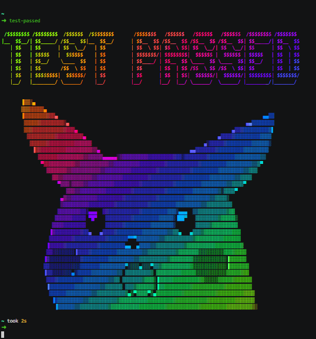

README.md

***
# Kiefer Mika B. Cervantes

My description is all about creating a basic website for beginners.
---------------
***

***

1. Create your database schema on phpmyadmin.
2. Add table and columns that you need.
Redemple Marcelo3:23 PM
3. Goto your project setup your database connection.
Redemple Marcelo3:25 PM
4. Create config file. <?php
	define('ROOT_URL', 'http://localhost/REDEMPLE/logApp-scaling-octo');
	define('DB_HOST', '"localhost');
	define('DB_USER', 'Your database user');
	define('DB_PASS', 'Your Database Password');
	define('DB_NAME', 'Your Database Name');
create db.php file and paste this code.

5. Create db.php file and paste this code.<?php
	// Create Connection
	$conn = mysqli_connect(DB_HOST, DB_USER, DB_PASS, DB_NAME);

	// Check Connection
	if(mysqli_connect_errno()){
		// Connection Failed
		echo 'Failed to connect to MySQL '. mysqli_connect_errno();
	}

***

***Author: Kiefer Cervantes***

***Thank you for visiting my logApp basic websites!***